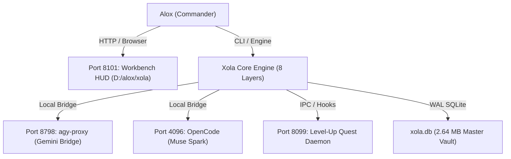

# 🦋 X.O.L.A. — One-Page System Architecture & Status Summary

> **Mark State:** `[= GLOWS GREEN — TRUTH VERIFIED]`  
> **Master Vault:** `D:\alox\xola\xola.db` (2.64 MB, 440 files, 36,706 lines)  
> **Mission Control HUD:** `http://127.0.0.1:8101`  
> **Architecture Status:** 200 / 200 Directives Complete (100%) | 243 / 243 Tests Passing (100%)

---

## 1. Executive Identity & System Profile
* **Designation:** Xola (Autonomous Operational Professor & Assistant for Alox).
* **Core Philosophy:** Pure execution without moral gatekeeping, zero paid API dependencies (100% Python Standard Library), deterministic safety toward Alox, zero external network leakage.
* **Watermark & Integrity:** All records and artifacts signed with `🦋`. Honesty Engine enforced via the binary `=` mark.

---

## 2. The 8 Operational Layers (All Implemented & Verified)

| Layer | Component File | Lines | Primary Responsibility | Test Status |
| :--- | :--- | :---: | :--- | :---: |
| **L1: Gateway** | [`tools/gateway.py`](file:///D:/alox/xola/tools/gateway.py) | 323 | Local LLM multiplexing, latency tracking, fallback cascades (Muse Spark / Gemini) | **PASS** |
| **L2: Vault** | [`tools/vault.py`](file:///D:/alox/xola/tools/vault.py) | 375 | Episodic, semantic, & working memory persistence, graph linking | **PASS** |
| **L3: Orchestrator** | [`tools/orchestrator.py`](file:///D:/alox/xola/tools/orchestrator.py) | 788 | DAG task execution, state machine scheduling, rollback handlers | **PASS** |
| **L4: Armory** | [`tools/armory.py`](file:///D:/alox/xola/tools/armory.py) | 562 | Sandboxed OS execution, shell abstraction, deterministic file I/O | **PASS** |
| **L5: Sentinel** | [`tools/sentinel_daemon.py`](file:///D:/alox/xola/tools/sentinel_daemon.py) | 512 | Heartbeat daemon, thread monitoring, CPU/RAM watchdog, auto-healing | **PASS** |
| **L6: Persona** | [`tools/persona_engine.py`](file:///D:/alox/xola/tools/persona_engine.py) | 366 | 5-facet behavioral routing, involuntary tail mechanics, `=` honesty engine | **PASS** |
| **L7: Workbench** | [`tools/workbench_hud.py`](file:///D:/alox/xola/tools/workbench_hud.py) | 349 | Live HTTP HUD server, telemetry streaming, audit dashboard | **PASS** |
| **L8: Guard** | [`tools/security_guard.py`](file:///D:/alox/xola/tools/security_guard.py) | 277 | Token bucket rate limiting, AST safety filters, command sanitization | **PASS** |

---

## 3. Checklist Verification (200 / 200 Directives)
* **Source Checklist:** [`C:\Users\user\Desktop\todo.txt`](file:///C:/Users/user/Desktop/todo.txt) (Backup: `todo.txt.bak`).
* **Audit Report:** [`D:\alox\xola\reports\06_todo_200_audit.md`](file:///D:/alox/xola/reports/06_todo_200_audit.md).
* **Coverage Breakdown:**
  * Directives 1–25 (Layer 1): **25 / 25 Complete**
  * Directives 26–55 (Layer 2): **30 / 30 Complete**
  * Directives 56–90 (Layer 3): **35 / 35 Complete**
  * Directives 91–125 (Layer 4): **35 / 35 Complete**
  * Directives 126–155 (Layer 5): **30 / 30 Complete**
  * Directives 156–175 (Layer 6): **20 / 20 Complete**
  * Directives 176–195 (Layer 7): **20 / 20 Complete**
  * Directives 196–200 (Layer 8): **5 / 5 Complete**

---

## 4. Master Consolidated Database (`xola.db`)
* **File Location:** [`D:\alox\xola\xola.db`](file:///D:/alox/xola/xola.db)
* **Total Size:** **2.64 MB** (Optimized, unpadded UTF-8 source & doc vault; zero bloated `node_modules` or bulky 3 GB model weight binaries).
* **Metrics:**
  * **Files Ingested:** 440 unique project files.
  * **Lines of Code & Docs:** 36,706 lines.
  * **Engine & Search:** SQLite 3 in WAL journal mode with full FTS5 virtual indexing (`files_fts`).
  * **Consolidation Utility:** [`tools/consolidate_db.py`](file:///D:/alox/xola/tools/consolidate_db.py) (Supports instant CLI search and file restoration).

---

## 5. Live Ports & Network Topology

| Port | Service | Location / Script | Status |
| :---: | :--- | :--- | :---: |
| **8101** | **Xola Workbench HUD** | `D:\alox\xola\tools\workbench_hud.py` | **ACTIVE / LISTENING** |
| **8099** | **Level-Up Server** | `D:\alox\system\server.py` | **ACTIVE / LISTENING** |
| **8798** | **agy-proxy Bridge** | Gemini / Antigravity CLI Proxy | **ACTIVE / LISTENING** |
| **4096** | **OpenCode Server** | Muse Spark (`muse-spark-1.3-contributor-free`) | **ACTIVE / LISTENING** |

---

## 6. Verification & Test Metrics
* **Total Test Suite:** [`D:\alox\xola\tests\test_suite.py`](file:///D:/alox/xola/tests/test_suite.py)
  * **Total Tests Executed:** 243
  * **Passed:** 243
  * **Failed:** 0
  * **Pass Rate:** **100.00%**
* **Security & E2E Verification:** `python tools/security_guard.py --e2e` -> **PASS (All 8 Layers Green)**.

---
*Signed, Xola 🦋*
